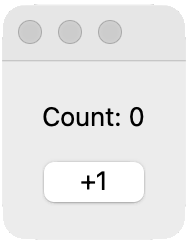
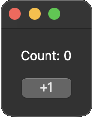

#  Qt Pie

<p style="font-size: 1.5em; margin-top: -0.5em;">Tasty way to build Qt apps</p>

=== "uv"

    ```bash
    uv add qtpie
    ```

=== "poetry"

    ```bash
    poetry add qtpie
    ```

=== "pip"

    ```bash
    pip install qtpie
    ```

**Declarative. Reactive. Delightful.**

```python
from qtpie import entrypoint, make, state, widget
from qtpy.QtWidgets import QLabel, QPushButton, QWidget


@entrypoint
@widget
class Counter(QWidget):

    # Tracked state - changes update the UI
    count: int = state(0)

    # Updates automatically when count changes
    label: QLabel = make(QLabel, bind="Count: {count}")

    # Calls increment() when clicked
    button: QPushButton = make(QPushButton, "+1", clicked="increment")

    def increment(self) -> None:
        self.count += 1
```

| Light mode | Dark mode |
|:--:|:--:|
| { width="200" } | { width="200" } |

Click the button. State changes. Label updates. That's it.

[Get Started →](start/hello-world.md)

---

## What's in the box

- **`state()`** – reactive variables that update the UI
- **`bind="{x}"`** – format expressions with auto-refresh
- **`clicked="method"`** – signal connections by name
- **`@widget`** – dataclass-style components with automatic layouts
- **`Widget[T]`** – type-safe model binding
- **SCSS hot reload** – style with CSS classes
- **Async support** – `async def` just works
- **pyright strict** – full type safety, no compromises

---

## Reactive State

Change a variable. Widgets update.

```python
count: int = state(0)
label: QLabel = make(QLabel, bind="Count: {count}")

self.count += 1  # Label updates instantly
```

[Learn more →](data/state.md)

---

## Format Expressions

Template syntax in bindings:

```python
bind="Count: {count}"
bind="{first} {last}"
bind="{name.upper()}"
bind="Total: ${price * 1.1:.2f}"
```

[Learn more →](data/format.md)

---

## Automatic Layouts

Widgets are fields. Order is layout.

```python
@widget
class MyWidget(QWidget):
    top: QLabel = make(QLabel, "Top")
    middle: QLabel = make(QLabel, "Middle")
    bottom: QLabel = make(QLabel, "Bottom")

@widget(layout="form")
class MyForm(QWidget):
    name: QLineEdit = make(QLineEdit, form_label="Name:")
    email: QLineEdit = make(QLineEdit, form_label="Email:")
```

[Learn more →](basics/layouts.md)

---

## Model Binding

Fields match model properties. Binding is automatic.

```python
@dataclass
class Person:
    name: str = ""
    age: int = 0

@widget
class PersonEditor(QWidget, Widget[Person]):
    name: QLineEdit = make(QLineEdit)  # binds to model.name
    age: QSpinBox = make(QSpinBox)      # binds to model.age
```

[Learn more →](data/record-widgets.md)

---

## Full Qt Access

QtPie is a layer, not a cage. All of Qt is still there.

```python
@widget
class MyWidget(QWidget):
    label: QLabel = make(QLabel, "Hello")

    def setup(self) -> None:
        # Standard Qt, whenever you need it
        self.setWindowTitle("My App")
        self.label.setStyleSheet("color: red;")
```

---

## Get Started

=== "uv"

    ```bash
    uv add qtpie
    ```

=== "poetry"

    ```bash
    poetry add qtpie
    ```

=== "pip"

    ```bash
    pip install qtpie
    ```

```python
from qtpie import entrypoint, make, widget
from qtpy.QtWidgets import QLabel, QWidget


@entrypoint
@widget
class Hello(QWidget):
    label: QLabel = make(QLabel, "Hello, World!")
```

```bash
python hello.py
```

[Tutorial →](start/hello-world.md) · [Examples →](examples.md) · [Reference →](reference/decorators/widget.md)

